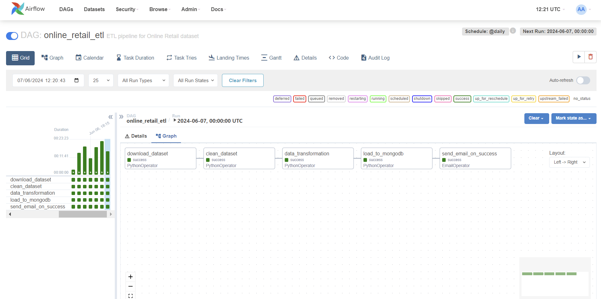

# Assignment: Building an ETL Pipeline with Apache Airflow

The following project involves creating an ETL pipeline using Apache Airflow to handle data from the "Online Retail" dataset sourced from the UCI Machine Learning Repository. This dataset comprises transactions from a UK-based online retail store between December 1, 2010, and December 9, 2011. The pipeline processes this data and loads it into a MongoDB database, with the intention of preparing it for subsequent ML model implementations.



## Table of Contents

- [Installation](#installation)
- [Usage](#usage)
- [License](#license)
- [Acknowledgements](#acknowledgements)


## Installation

To install this project and its dependencies using Docker Compose, follow these steps:

1. **Download and unzip the project folder:**

   Download the project ZIP file and unzip it to your desired location. The folder name should be `airflow`

2. **Navigate to the project directory:**

   ```bash
   cd path/to/unzipped/airflow

3. **Create a `logs` and `plugins` folder inside the airflow folder:**

4. **Create and configure .env file**

    Create a .env file in the project root directory with the following contents, adjusting the values as necessary:

    ```bash
    AIRFLOW_UID=50000
    SMTP_USER='' # Gmail Account
    SMTP_PASSWORD='' # Gmail 16-digit App Password

    To generate a Gmail 16-digit App Password, please refer to this tutorial: [https://support.google.com/accounts/answer/185833?hl=en](https://support.google.com/accounts/answer/185833?hl=en)

5. **Build the Docker containers**

    ```bash
   docker-compose build

6. **Start the airflow services**

    ```bash
   docker-compose up airflow-init

## Usage

To use this project, follow these steps:

1. **Start the Airflow services:**

    If the services are not already running, start them with:

    ```bash
    docker-compose up -d

2. **Access the Airflow web interface:**

   Navigate to [http://localhost:8080](http://localhost:8080) in your web browser and log in with the following credentials:
   
   - **Username:** `airflow`
   - **Password:** `airflow`

3. **Configure your MongoDB connection within Airflow**
   
   - Click on the "Admin" menu at the top and then select "Connections" from the dropdown menu.
   
   - Click the "Create" button to add a new connection.
   
   - Fill in the following details:
     - **Connection Id**: Choose a unique identifier for the connection, e.g., `mongo_default`.
     - **Connection Type**: Select `MongoDB` from the dropdown menu.
     - **Host**: The hostname of your MongoDB server.
     - **Login**: The username used to authenticate with the MongoDB server.
     - **Password**: The password used to authenticate with the MongoDB server.
     - **Extra**: {"srv": true}
   
   - Click the "Save" button to create the connection.

4. **Trigger the ETL pipeline DAG:**

    From the Airflow web interface, locate the `online_retail_etl` DAG and trigger it manually to test its functionality.

5. **Stop the Airflow services**

    If you wish to stop the services, run:

    ```bash
    docker-compose down

## License

This project is licensed under the MIT License. See the LICENSE file for details.

## Acknowledgements

* The UCI Machine Learning Repository for providing the “Online Retail” dataset.
* The Apache Airflow community for their extensive documentation and support.

